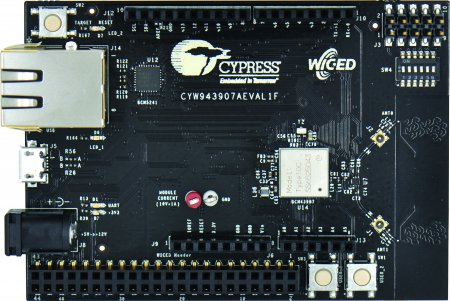
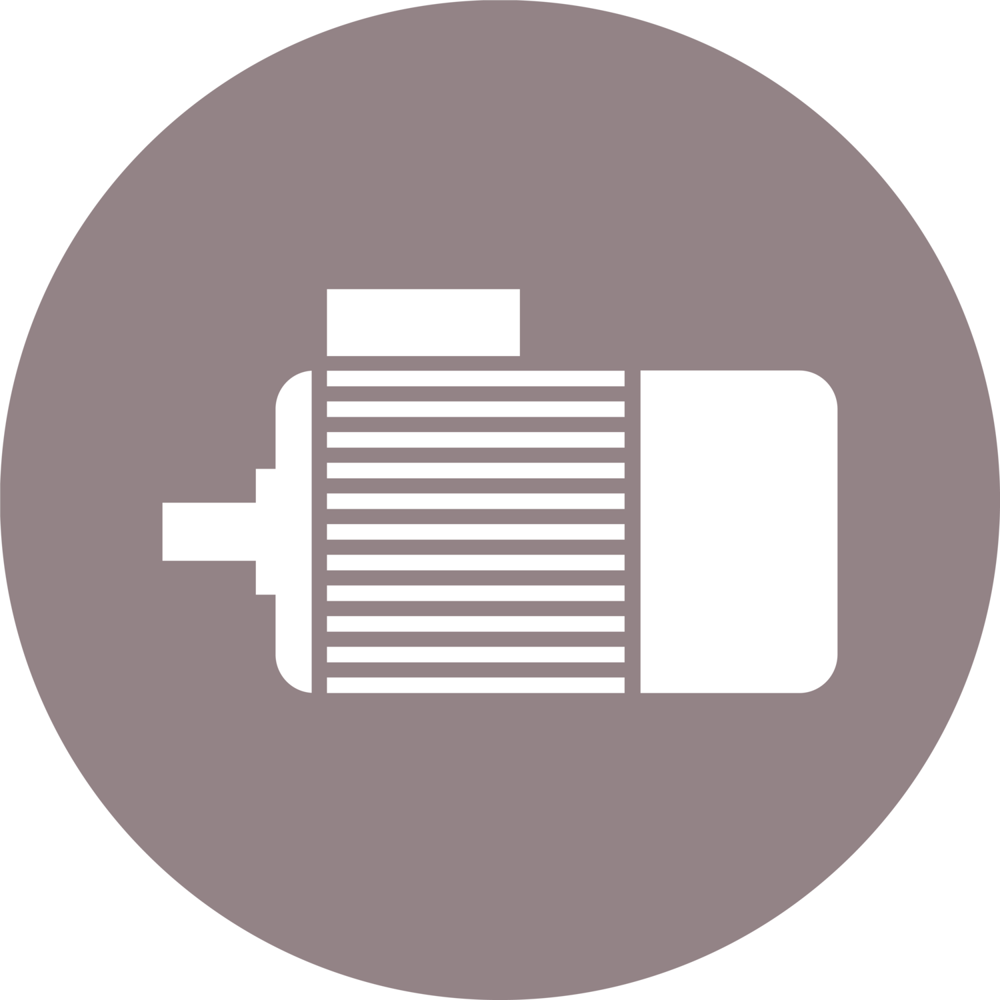

### Overview

In this quick tutorial we will explain how to use the TLE94112 shield together with the Cypress WICED SDK, compile the provided example, and execute it.

### Required Hardware

Name         | Picture |
---          |---      |
[CYW943907AEVAL1F Evaluation Kit](https://www.cypress.com/documentation/development-kitsboards/cyw943907aeval1f-evaluation-kit) | |
TLE94112 | |
a DC Motor |  |
a power source | between 4V and 40V, reasonable for your motor
pin headers | solder them to the shield
Micro-USB to USB A cable | use the cable included into the CYW943907AEVAL1F Evaluation Kit

### Required Software

* [WICED Studio](https://community.cypress.com/community/software-forums/wiced-wifi/wiced-wifi-documentation)
* [TLE94112](https://github.com/Infineon/DC-Motor-Control-TLE94112EL) (v2.0.0 or higher)
* for Windows: [PuTTY](https://www.chiark.greenend.org.uk/~sgtatham/putty/latest.html) Serial Terminal 
* for Linux: [miniCom](https://help.ubuntu.com/community/Minicom)
* this library (Installed with WICED SDK)

### Tutorial

#### Software Installation

0. **install WICED Studio**. Download the software and follow the instructions in the following [website](https://community.cypress.com/community/software-forums/wiced-wifi/wiced-wifi-documentation). Registration is required.

1. **for Windows install PuTTY**. Downloadable from the official [website](https://www.chiark.greenend.org.uk/~sgtatham/putty/latest.html) or use an other
sufficient terminal under your system.

2. **for Linux install miniCom**. Use your system installer (apt, apt-get, pkcon, zypper or similar). You can also use any other
similar software.

3. **install the TLE94112 library**. Follow the steps in the [WICED Lib Installation](CW-Lib-Installation) section. 

#### Hardware Setup

The TLE94112 needs to be stacked on the mcu and due to the pin layout of the headers, this is fail save.
Then, simply connect it to the computer with the USB cable. If you are using the Cypress 43xxx boards, than refer
to the board documentation or schematics to check wether the 5V VDD pin is connected or not. If not than 
you must bridge the 3.3V VDD pin and 5V VDD pin on the arduino header to power up the shield.
See also the [trouble shooting guide](CW-Troubleshooting-Guide).

#### Ready To Go!

With the hardware connected, the software installed, and the several [bugs fixing](CW-Troubleshooting-Guide) changes made to the SDK, the example can be finally built and run:

1. **Example basicTest**

   Open the snip example (*apps/snip/TLE94112/basicTest*).

2. **Terminal output**

   Open the PuTTY serial terminal with 115200 baud, 8-N-1, and the appropriate COM port (or *tty* device).

   

3. **WICED make target**

   Create target *"snip.TLE94112/basicTest-CYW943907AEVAL1F download run"* and click on it. 

   

   The terminal will soon prompt the *TLE94112* ready message and prints out the next operation on the motor.
   If everything is connected, the motor should run up and down, forward and backward (if capable of).

