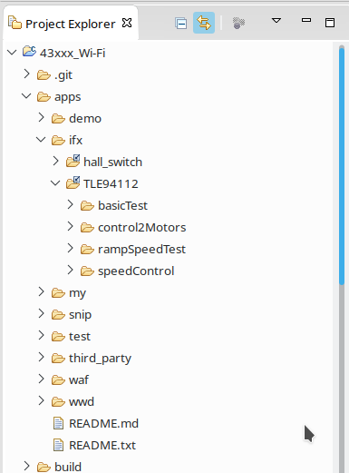

### 43xxx Wi-Fi Platforms

The installation process described here applies for the **43xxx-Wi-Fi** platform:

1. Download the .zip or tar.gz file from [releases](https://github.com/Infineon/DC-Motor-Control-TLE94112EL/releases) and extract it in the following location:

   ```
   <!-- <path_to_WICED_workspace>/WICED-Studio-6.4/43xxx_Wi-Fi/libraries/drivers/motor-control/ -->
   ```
   Set the library folder name to **TLE94112**.

   This *path_to_WICED_workspace* is by default installed in *C:\\* for windows and in *home/* for Linux. 

   The folder can be located in any other valid component folder. Nevertheless, the *43xxx-Wi-Fi/libraries/drivers/motor-control* is logically the folder where hardware peripheral libraries for motor controlling should be placed. 

2. Copy the *app* folder from *TLE94112/src/framework/wiced-43xxx* into the *apps/ifx/TLE94112* path (you can also use the snip directory or any other directory in the app folder, it will also work). 

     

3. Alternatively use the *conf_lib.bat* (for Windows) or *conf_lib.sh* (in Linux) in the *.../motor-control/TLE94112/scr/framework/wiced-43xxx* folder.
   They will create a symbolic link in the *apps/ifx* folder automatically.
   :warning: But be aware that linked files will be change in both locations when modified!

4. With this configuration the different make targets can be created with the WICED make target naming conventions. This is described thoroughly in section 3.4 of the User Guide, which can be found here: s*43xxx-Wi-Fi/doc/WICED-QST.pdf*.


#### :warning: **Before Building** :warning:

Before being able to build the application code, a few more thing needs to be fixed. **Check the [Troubleshooting Guide](CW-Troubleshooting-Guide) section to fix the C++ build error in WICED Studio (experienced with 6.4.0 version)**.

### 207xxxx A/B Bluetooth Platforms

The integration of the library for the BLE platforms is currently **NOT implemented**.