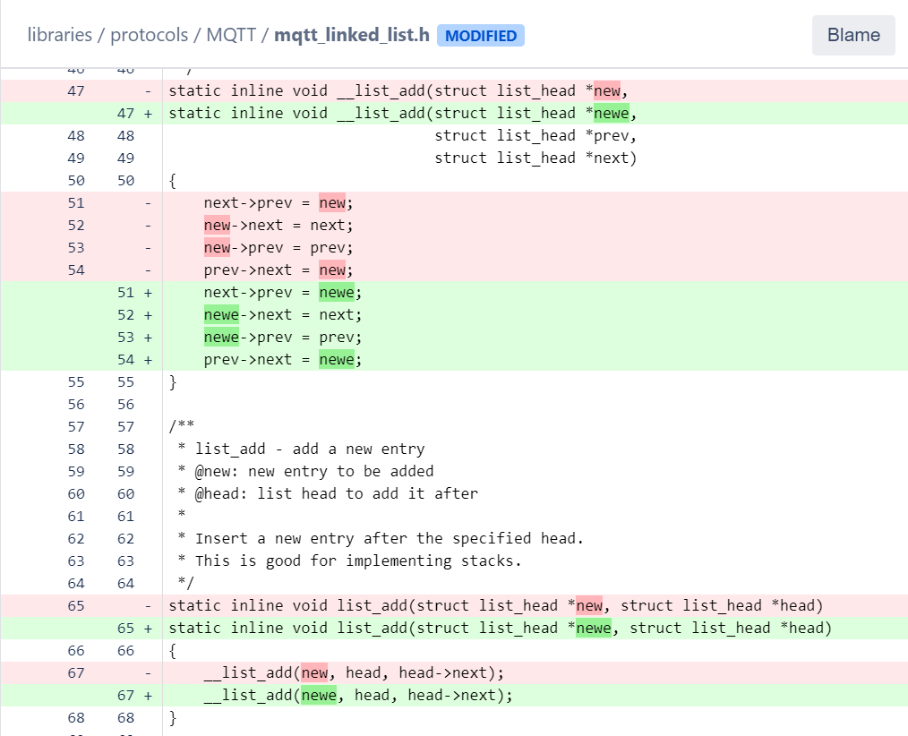
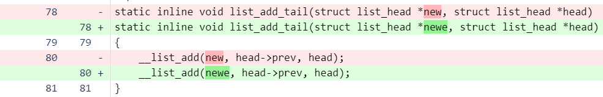
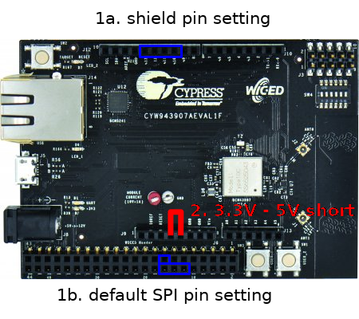

## Troubleshooting for C++ Builds

The following changes are requires for an error free build when using the *TLE94112* library.
Other errors might appear as different SDK components and sources are included. These are only the one experienced during the integration of the framework library setup.

### Issue with C++ Include Guards

The WICED Studio (version 6.4.0) toolchain support C and C++ language. The *TLE94112* library is written in C++. 

Nevertheless, some of the guards braces to include C in C++ such

```
#ifdef _cplusplus 
extern "C" { 
#endif
``` 
are not closed, leading to compilation error.

#### Quick Workaround 

As a quick a workaround, in the main program entry point after the ***application_start( ){}*** block add an additional **"*}*"** closing brace. 

In the provided *app* examples file:

```
...

void application_start( )
{
    wiced_result_t      result;

    /* Initialize the device */
    result = wiced_init();
    if (result != WICED_SUCCESS)
    {
        return;
    }

    ... //Main application
}

//} /**< Insert and uncomment for WICED missing _cplusplus guards workaround */
``` 
Even confusing and not elegant it will do the work.

#### Known Files Requiring Closing **"*}*"**

The proper long term solution is to fix those files with unclosed blocks. The following files (in version 6.4.0) have been found with this issue:

* *apps/snip/bluetooth/simple_ble_peripheral/ble_event_map.h*
* *apps/snip/bluetooth/simple_ble_peripheral/simple_ble_peri.h*
* *WICED/platform/ARM_CR4/platform_checkpoint.h*
* *WICED/platform/security/BESL/mbedtls_open/include/mbedtls/md5_alt.h*

Add the following to the bottom of the file:
``` 
#ifdef __cplusplus
} /* extern "C" */
#endif
```

### MQTT Module Reserved C++ Keywords

When including the MQTT module additional compilation errors appear. The keyword ```new``` is reserved in C++. 
In the file *libraries/protocols/MQTT/mqtt_linked_list.h* substitute it for a non-reserved one, as i.e. ```newe```. 
Also ```NULL``` needs to be rewritten as ```(void *) 0```. Check the modifications here:






### Changes for the SPI interface

The default pin setting for the first SPI port is on the WICED Header J6 and not on the Arduino Header J12.
This will not work with an Arduino compatible shield attached, so we have to change the pin layout for
not only the chip select (SS) pin, but also for the miso (MISO), mosi (MOSI) and system clock pin (SCK).
(see picture 1.a. the target SPI pin, 1.b. the default set SPI pins)

Default setting for SPI port WICED_SPI_1. This does not work for Arduino shields!.
```
    MOSI = WICED_GPIO_21
    MISO = WICED_GPIO_19
    SCK = WICED_GPIO_20
    SS = WICED_GPIO_22
```

Pin setting which works for Arduino shields.
```
    MOSI = WICED_GPIO_6
    MISO = WICED_GPIO_8
    SCK = WICED_GPIO_5
    SS = WICED_GPIO_7
```

The *TLE94112* needs a continuous low signal on chipselect (SS) during send and receive part, which will not work with the 
SPI driver default setting. Therefore we set the chipselect (SS) pin on WICED_GPIO_NONE and the real chipselect on WICED_GPIO_7
in the framework SPIC class. Also the default GSIO SPI driver is not complete. We will exchange that with the bit banging driver too.
So a pin setting which works for the TLE94112 shield looks like:
```
    MOSI = WICED_GPIO_6
    MISO = WICED_GPIO_8
    SCK = WICED_GPIO_5
    SS = WICED_GPIO_NONE
```

For these changes in the SPI we add an additional SPI port to the platform_spi_peripherals list as WICED_SPI_0 with the
following setting in the *<WICED_SDK>/platforms/<platform_name>/platform.c file. This additional setting will not disturb
any existing code, as we define a new SPI port.
```
const platform_spi_t platform_spi_peripherals[] =
{
    [WICED_SPI_0]  =
    {
       .port                    = BCM4390X_SPI_0,
       .pin_mosi                = &platform_gpio_pins[WICED_GPIO_6],
       .pin_miso                = &platform_gpio_pins[WICED_GPIO_8],
       .pin_clock               = &platform_gpio_pins[WICED_GPIO_5],
       .pin_cs                  = &platform_gpio_pins[WICED_GPIO_NONE],
       .driver                  = &spi_bb_driver,
    },
```

Additional to the platform_spi_peripherals setting we need to extend the wiced_spi_t enum in *<WICED_SDK>/platforms/<platform_name>/platform.h
to this, by including the WICED_SPI_0 into it (see picture below).
```
typedef enum
{
    WICED_SPI_0,
    WICED_SPI_1,
    WICED_SPI_2,
    WICED_SPI_MAX, /* Denotes the total number of SPI port aliases. Not a valid SPI alias */
} wiced_spi_t;
```

Files to be change:
* *<WICED_SDK>/platforms/<platform_name>/platform.h
* *<WICED_SDK>/platforms/<platform_name>/platform.c



### Powering the shield
Last, but not least we need to power the *TLE94112* shield. Also this shield can run with either 3.3V or 5V, it needs it VDD power on the
5V pin of the Arduino header, but this pin is not connected on the 43xxx board, so we have to set the 3.3V and the 5V pin short 
(see picture above under 2.).
