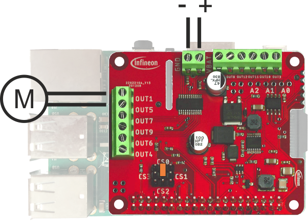
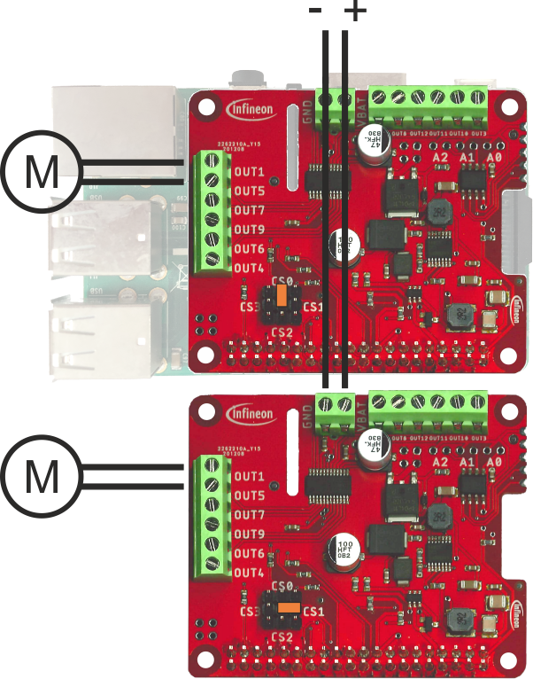

The following examples show how to use the Python wrapper of the multi half bridge library with the TLE94112ES HAT for Raspberry Pi.

**Note**:- Before running the examples Raspberry Pi needs to be ready with the library installed and repository cloned as described [here](Py-Getting-Started).

#### :information_source: Note
Please open the example source file at `src/framework/raspberrypi/examples_py/*.py` and read the comments before compiling it.

**basicTest**

This example shows how to switch two half bridge outputs with minimal code.

It will switch on two outputs (one to Vsup and one to GND), wait 3 seconds and switch off both outputs (both to floating state).

#### Hardware setup

The TLE94112ES HAT needs to be stacked onto a Raspberry Pi. A jumper needs to be placed between the middle pin and the CS0 marking as shown in the picture. The HAT needs to be connected to a 5.5V to 20V DC power supply. A bidirectional DC motor (max. 0.9A) has to be connected to output 1 and 5 of the HAT.

**advancedTest**

This example is meant for one bidirectional motor, connected to
output 1 and 5 of the TLE94112ES HAT for Raspberry Pi.
It demonstrates the following library functions:

Basic motor control

 * Run motor forward without PWM

 * Stop (brake) motor
 * Run motor backwards without PWM
* Coast motor
  
Motor control with PWM
* Run motor forward with PWM (50% duty cycle)
* Stop (brake) motor with PWM (50% duty cycle)

Ramp up/down motor speed
- Slowly ramp up duty cycle from 0% to 100%
- Slowly ramp down duty cycle from 100% to 50%
- Quickly ramp up duty cycle from 50% to 100%
 - Quickly ramp down duty cycle from 100% to 0%
 
#### Hardware setup

The TLE94112ES HAT needs to be stacked onto a Raspberry Pi. A jumper needs to be placed between the middle pin and the CS0 marking as shown in the picture. The HAT needs to be connected to a 5.5V to 20V DC power supply. A bidirectional DC motor (max. 0.9A) has to be connected to output 1 and 5 of the HAT.

### errorDiagnosis

#### Description
This example shows how to read and understand the status registers of the TLE94112. It will run the motor in forward direction and then read the status registers every 5 seconds. It shows how to understand the status registers and which errors can appear. Take this example if you want to learn how to debug the TLE94112 during operation.

#### Hardware setup

The TLE94112ES HAT needs to be stacked onto a Raspberry Pi. A jumper needs to be placed between the middle pin and the CS0 marking as shown in the picture. The HAT needs to be connected to a 5.5V to 20V DC power supply. A load (max. 0.9A) has to be connected to output 1 and 5 of the HAT. If you want to trigger errors you be ready to create a short circuit between output 1 and output 5 or disconnect the load to get an open load error.

### multipleMotors

#### Description
This example demonstrates how to control two motors, their speed and direction with the TLE94112.

#### Hardware setup

The TLE94112ES HAT needs to be stacked onto a Raspberry Pi. A jumper needs to be placed between the middle pin and the CS0 marking as shown in the picture. The HAT needs to be connected to a 5.5V to 20V DC power supply. A load (max. 0.9A) has to be connected to output 1 and 5 of the HAT. Another load has to be connected between output 7 and 9.

### multipleControllers

#### Description
This example shows how to use multiple TLE94112 controllers simultaneously. For this example it is assumed that two TLE94112 controllers are connected to one Raspberry Pi. The Chip Select pin of controller 1 is set to CS0 and the Chip Select pin of controller 2 is set to CS1. On both controllers a load is connected between half bridge 1 and 5. This example shows, how to control both motor controllers from one Raspberry Pi.

#### Hardware setup

Both TLE94112ES HATs need to be stacked onto a Raspberry Pi. A jumper needs to be placed between the middle pin and the CS0 marking on controller 1 as shown in the picture. Another jumper needs to be placed between the middle pin and CS1 on controller 2. Both HATs needs to be connected to a 5.5V to 20V DC power supply. A load (max. 0.9A) has to be connected to output 1 and 5 of both HATs.

