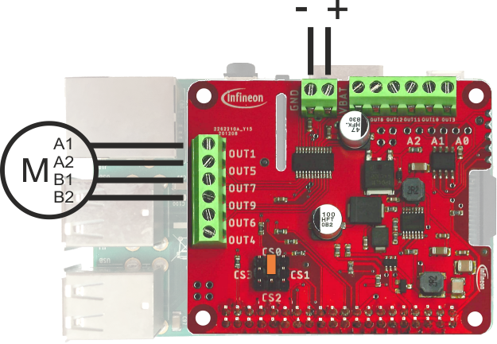

The following examples are provided for Raspberry Pi:

:warning: **Important:** Before running these examples make sure that all requirements are installed properly as explained [here](RPi-Library-Installation).

### basicTest

#### Description
This example shows how to switch two half bridge outputs with minimal code. It will switch on two outputs (one to Vsup and one to GND), wait 3 seconds and switch off both outputs (both to floating state).

#### Hardware setup

The TLE94112ES HAT needs to be stacked onto a [compatible](RPi-Library-Installation###Compatibility) Raspberry Pi. A jumper needs to be placed between the middle pin and the CS0 marking as shown in the picture. The HAT needs to be connected to a 5.5V to 20V DC power supply. A load (max. 0.9A) has to be connected to output 1 and 5 of the HAT.


#### :information_source: Note
Please open the example source file at `src/framework/raspberrypi/examples/basicTest.cpp` and read the comments before compiling it.

#### Compile

Change to Raspberry Pi framework folder:
```
cd src/framework/raspberrypi
```

Clean if any other example was compiled before:
```
make clean
```

Compile the example:
```
make examples/basicTest
```

Run the example:
```
../../../build/basicTest
```

:warning: **Important:** If you did not install the BCM2835 library with BCM2835_HAVE_LIBCAP option make sure to use sudo (root rights) when executing your binary. Otherwise it will fail with segmentation fault.


### advancedTest

#### Description
 This example runs an advanced controller test with one attached motor on the controller. It is meant for one bidirectional motor, connected to **output 1 and 5** of the TLE94112. It demonstrates the following library functions:
 * Basic motor control
   * Run motor forward without PWM
   * Stop (brake) motor
   * Run motor backwards without PWM
   * Coast motor
 * Motor control with PWM
   * Run motor forward with PWM (50% duty cycle)
   * Stop (brake) motor with PWM (50% duty cycle)
 * Ramp up/down motor speed
    * Slowly ramp up duty cycle from 0% to 100%
    * Slowly ramp down duty cycle from 100% to 50%
    * Quickly ramp up duty cycle from 50% to 100%
    * Quickly ramp down duty cycle from 100% to 0%

#### Hardware setup

The TLE94112ES HAT needs to be stacked onto a [compatible](RPi-Library-Installation###Compatibility) Raspberry Pi. A jumper needs to be placed between the middle pin and the CS0 marking as shown in the picture. The HAT needs to be connected to a 5.5V to 20V DC power supply. A bidirectional DC motor (max. 0.9A) has to be connected to output 1 and 5 of the HAT.


#### :information_source: Note
Please open the example source file at `src/framework/raspberrypi/examples/advancedTest.cpp` and read the comments before compiling it.

#### Compile

Change to Raspberry Pi framework folder:
```
cd src/framework/raspberrypi
```

Clean if any other example was compiled before:
```
make clean
```

Compile the example:
```
make examples/advancedTest
```

Run the example:
```
../../../build/advancedTest
```

:warning: **Important:** If you did not install the BCM2835 library with BCM2835_HAVE_LIBCAP option make sure to use sudo (root rights) when executing your binary. Otherwise it will fail with segmentation fault.


### errorDiagnosis

#### Description
This example shows how to read and understand the status registers of the TLE94112. It will run the motor in forward direction and then read the status registers every 5 seconds. It shows how to understand the status registers and which errors can appear. Take this example if you want to learn how to debug the TLE94112 during operation.

#### Hardware setup

The TLE94112ES HAT needs to be stacked onto a [compatible](RPi-Library-Installation###Compatibility) Raspberry Pi. A jumper needs to be placed between the middle pin and the CS0 marking as shown in the picture. The HAT needs to be connected to a 5.5V to 20V DC power supply. A load (max. 0.9A) has to be connected to output 1 and 5 of the HAT. If you want to trigger errors you be ready to create a short circuit between output 1 and output 5 or disconnect the load to get an open load error.


#### :information_source: Note
Please open the example source file at `src/framework/raspberrypi/examples/errorDiagnosis.cpp` and read the comments before compiling it.

#### :warning: Warning
This example will not terminate automatically. Use **CTRL + C** to terminate it.

#### Compile

Change to Raspberry Pi framework folder:
```
cd src/framework/raspberrypi
```

Clean if any other example was compiled before:
```
make clean
```

Compile the example:
```
make examples/errorDiagnosis
```

Run the example:
```
../../../build/errorDiagnosis
```

:warning: **Important:** If you did not install the BCM2835 library with BCM2835_HAVE_LIBCAP option make sure to use sudo (root rights) when executing your binary. Otherwise it will fail with segmentation fault.


### multipleMotors

#### Description
This example demonstrates how to control two motors, their speed and direction with the TLE94112.

#### Hardware setup

The TLE94112ES HAT needs to be stacked onto a [compatible](RPi-Library-Installation###Compatibility) Raspberry Pi. A jumper needs to be placed between the middle pin and the CS0 marking as shown in the picture. The HAT needs to be connected to a 5.5V to 20V DC power supply. A load (max. 0.9A) has to be connected to output 1 and 5 of the HAT. Another load has to be connected between output 7 and 9.


#### :information_source: Note
Please open the example source file at `src/framework/raspberrypi/examples/multipleMotors.cpp` and read the comments before compiling it.

#### Compile

Change to Raspberry Pi framework folder:
```
cd src/framework/raspberrypi
```

Clean if any other example was compiled before:
```
make clean
```

Compile the example:
```
make examples/multipleMotors
```

Run the example:
```
../../../build/multipleMotors
```

:warning: **Important:** If you did not install the BCM2835 library with BCM2835_HAVE_LIBCAP option make sure to use sudo (root rights) when executing your binary. Otherwise it will fail with segmentation fault.


### halfBridge

#### Description
The example shows how to control the half bridges to switch generic loads.

#### Hardware setup

The TLE94112ES HAT needs to be stacked onto a [compatible](RPi-Library-Installation###Compatibility) Raspberry Pi. A jumper needs to be placed between the middle pin and the CS0 marking as shown in the picture. The HAT needs to be connected to a 5.5V to 20V DC power supply. A load (max. 0.9A) has to be connected to output 1 and 5 of the HAT.


#### :information_source: Note
Please open the example source file at `src/framework/raspberrypi/examples/halfBridge.cpp` and read the comments before compiling it.

#### Compile

Change to Raspberry Pi framework folder:
```
cd src/framework/raspberrypi
```

Clean if any other example was compiled before:
```
make clean
```

Compile the example:
```
make examples/halfBridge
```

Run the example:
```
../../../build/halfBridge
```

:warning: **Important:** If you did not install the BCM2835 library with BCM2835_HAVE_LIBCAP option make sure to use sudo (root rights) when executing your binary. Otherwise it will fail with segmentation fault.


### stepperMotor

#### Description
The multi half bridge TLE94112ES is able to drive voltage-controlled bipolar stepper motors This example shows how to control a stepper motor with the DC Motor Control HAT with TLE94112ES.

#### Hardware setup

The TLE94112ES HAT needs to be stacked onto a [compatible](RPi-Library-Installation###Compatibility) Raspberry Pi. A jumper needs to be placed between the middle pin and the CS0 marking as shown in the picture. The HAT needs to be connected to a 5.5V to 20V DC power supply. A low-current (<900 mA peak) voltage-controlled bipolar stepper motor needs to be connected as follows:
- Coil A, high side (A1) to half bridge output 1
- Coil A, low side (A2) to half bridge output 5
- Coil B, high side (B1) to half bridge output 7
- Coil B, low side (B2) to half bridge output 9



#### :information_source: Note
Please open the example source file at `src/framework/raspberrypi/examples/stepperMotor.cpp` and read the comments before compiling it.

#### Compile

Change to Raspberry Pi framework folder:
```
cd src/framework/raspberrypi
```

Clean if any other example was compiled before:
```
make clean
```

Compile the example:
```
make examples/stepperMotor
```

Run the example:
```
../../../build/stepperMotor
```

:warning: **Important:** If you did not install the BCM2835 library with BCM2835_HAVE_LIBCAP option make sure to use sudo (root rights) when executing your binary. Otherwise it will fail with segmentation fault.